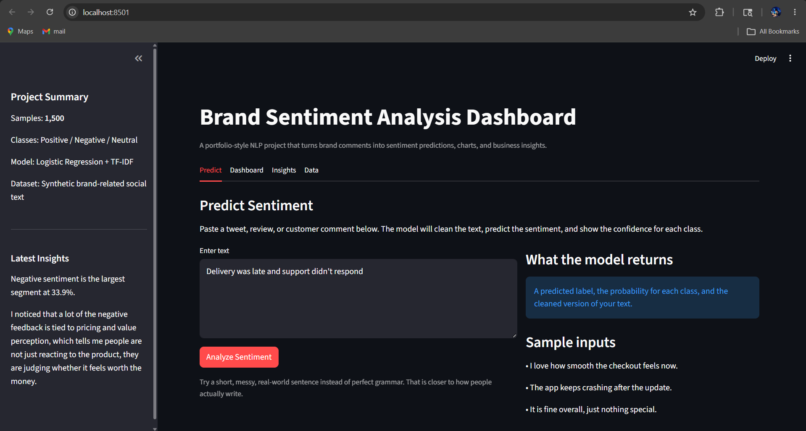
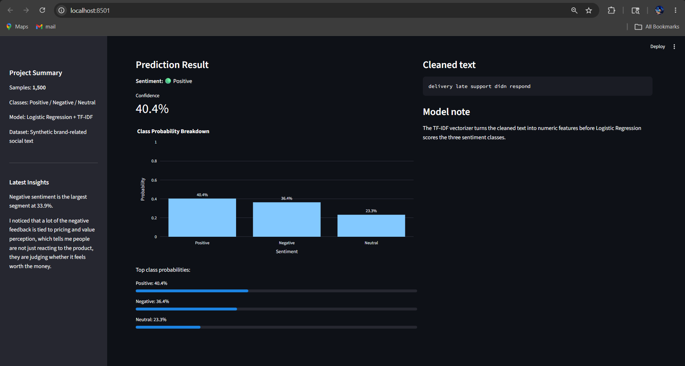

# Brand Sentiment Analysis Dashboard

I built this project to understand how businesses can actually use sentiment analysis to make decisions, not just classify text into labels.

Instead of keeping it as a simple ML script, I tried to build something closer to a small product — where you can input text, get predictions, and also see insights in a clear way.

---

## 📸 Project Preview





---

## 🧠 Problem

Businesses receive a lot of feedback in the form of reviews, tweets, and comments.  
Reading everything manually is not practical.

This project helps to:
- automatically classify sentiment
- understand overall customer opinion
- highlight patterns in feedback

---

## ⚙️ What This Project Does

- Classifies text into Positive / Negative / Neutral
- Cleans and preprocesses text data
- Trains a machine learning model
- Shows sentiment distribution and trends
- Generates word clouds and keyword insights
- Provides a Streamlit dashboard for interaction

---

## 🧱 Tech Stack

- Python  
- pandas, numpy  
- scikit-learn  
- nltk  
- matplotlib, seaborn, plotly  
- Streamlit  
- wordcloud  

---

## 📊 Dataset

This project uses a generated dataset of around 1,500 text samples.

The data includes:
- short customer-style reviews
- mixed tone sentences
- realistic product/service feedback

I kept it generated so the project stays easy to run and fully self-contained.

---

## 🧹 Text Preprocessing

Steps used:
- lowercase conversion  
- removing punctuation  
- removing stopwords  
- tokenization  
- TF-IDF vectorization  

I noticed that even small changes in preprocessing can affect the results a lot.

---

## 🤖 Model

Model used:
- Logistic Regression

### Metrics:
- Accuracy: ~94%
- Precision: ~94%
- Recall: ~94%
- F1 Score: ~94%

I chose a simple model because it works well with clean data and is easier to understand.

---

## 📈 Visualizations

The project generates:
- sentiment distribution chart  
- sentiment trend chart  
- word clouds for each sentiment  
- top keyword charts  

These visuals make it much easier to explain results to non-technical users.

---

## 💡 Key Observations

- Negative sentiment often relates to delays and pricing issues  
- Positive sentiment is usually about ease of use and experience  
- Neutral comments are common and often less detailed  

---

## 💭 My Approach

I wanted to build something that shows the full pipeline:
raw text → cleaned data → model → insights → dashboard

Instead of focusing only on accuracy, I focused on making the output understandable and usable.

---

## 📚 What I Learned

- Text cleaning is more important than expected  
- Simple models can perform well with good preprocessing  
- Visuals make analysis much easier to communicate  
- A dashboard makes the project feel practical, not just technical  

---

## 🧠 Product Thinking

This project is designed as a simple tool for:
- product teams  
- marketing teams  
- support teams  

### How it works:
1. Enter text input  
2. Get sentiment prediction  
3. View probability and insights  
4. Use it for decision making  

---

## 🖥 How to Run

### 1. Install dependencies
```
pip install -r requirements.txt
```

### 2. Run full pipeline
```
python run_all.py
```

### 3. Launch dashboard
```
streamlit run app/streamlit_app.py
```

---

## 📁 Project Structure

```
brand_sentiment_dashboard/
├── app/
├── assets/
├── data/
├── models/
├── src/
├── notebooks/
├── README.md
├── requirements.txt
└── run_all.py
```

---

## 🚀 Future Improvements

- Try advanced models like BERT  
- Use real-world dataset  
- Improve UI design  
- Deploy as web app  

---

## 👤 Author

Mohit Jyani  
Student | UI/UX + AI Projects
